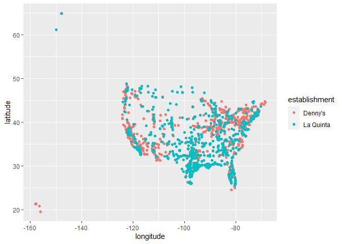
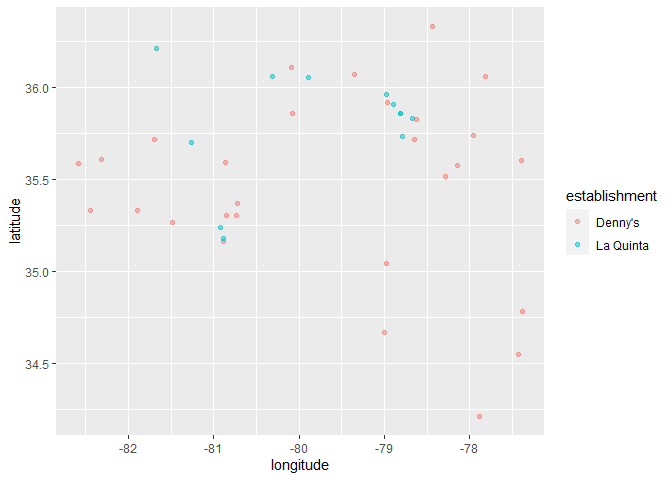
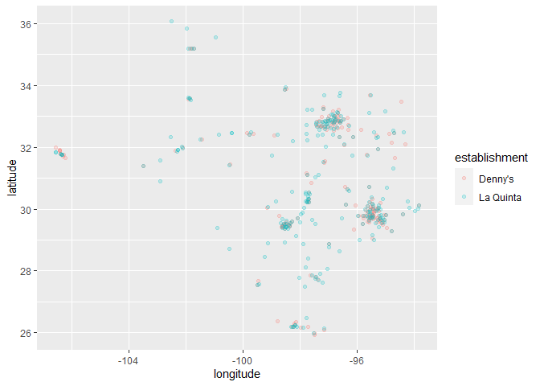

Lab 04 - La Quinta is Spanish for next to Denny’s, Pt. 1
================
Qilin Zhang
2023/1/26

### Load packages and data

``` r
library(tidyverse) 
library(dsbox) 
```

``` r
states <- read_csv("data/states.csv")
```

### Exercise 1

The data has 6 columns and 1643 rows. Each row represents the data for
an individual dennys store. There are six variables which are address,
city, state, zip, longitude, latitude.

``` r
dim(dennys)
```

    ## [1] 1643    6

``` r
str(dennys)
```

    ## spc_tbl_ [1,643 × 6] (S3: spec_tbl_df/tbl_df/tbl/data.frame)
    ##  $ address  : chr [1:1643] "2900 Denali" "3850 Debarr Road" "1929 Airport Way" "230 Connector Dr" ...
    ##  $ city     : chr [1:1643] "Anchorage" "Anchorage" "Fairbanks" "Auburn" ...
    ##  $ state    : chr [1:1643] "AK" "AK" "AK" "AL" ...
    ##  $ zip      : chr [1:1643] "99503" "99508" "99701" "36849" ...
    ##  $ longitude: num [1:1643] -149.9 -149.8 -147.8 -85.5 -86.8 ...
    ##  $ latitude : num [1:1643] 61.2 61.2 64.8 32.6 33.6 ...
    ##  - attr(*, "spec")=
    ##   .. cols(
    ##   ..   address = col_character(),
    ##   ..   city = col_character(),
    ##   ..   state = col_character(),
    ##   ..   zip = col_character(),
    ##   ..   longitude = col_double(),
    ##   ..   latitude = col_double()
    ##   .. )

### Exercise 2

The data has 6 columns and 909 rows. Each row represents the data for an
individual laquinta location. There are six variables which are address,
city, state, zip, longitude, latitude.

``` r
dim(laquinta)
```

    ## [1] 909   6

``` r
str(laquinta)
```

    ## spc_tbl_ [909 × 6] (S3: spec_tbl_df/tbl_df/tbl/data.frame)
    ##  $ address  : chr [1:909] "793 W. Bel Air Avenue" "3018 CatClaw Dr" "3501 West Lake Rd" "184 North Point Way" ...
    ##  $ city     : chr [1:909] "\nAberdeen" "\nAbilene" "\nAbilene" "\nAcworth" ...
    ##  $ state    : chr [1:909] "MD" "TX" "TX" "GA" ...
    ##  $ zip      : chr [1:909] "21001" "79606" "79601" "30102" ...
    ##  $ longitude: num [1:909] -76.2 -99.8 -99.7 -84.7 -96.6 ...
    ##  $ latitude : num [1:909] 39.5 32.4 32.5 34.1 34.8 ...
    ##  - attr(*, "spec")=
    ##   .. cols(
    ##   ..   address = col_character(),
    ##   ..   city = col_character(),
    ##   ..   state = col_character(),
    ##   ..   zip = col_character(),
    ##   ..   longitude = col_double(),
    ##   ..   latitude = col_double()
    ##   .. )

### Exercise 3

There are a lot of laquinta location outside the US. There are 76 in
Mexico, three in Turkey, two in China and canada, one in New Zealand,
United Arab Emiratesm, Chile, and Colombia.

There are also a lot of dennys location outside the us. There are “one
in Chile, 60 in Canada, five in Mexico, three in Costa Rica, two in
Honduras, two in El Salvador, two in the United Kingdom and eight in New
Zealand.” source:
<https://en.wikipedia.org/wiki/Denny%27s#>:\~:text=1%2C593%20of%20Denny’s%201%2C698%20restaurants,and%20eight%20in%20New%20Zealand.

### Exercise 4

We can try to restrict the latitude and longitude data based on the
range of US territory and filter out all the latitude and longitude
combination that are not in the range. We can also look at the states
data. If a location is not in the US, it will likely contain state data
from the US.

### Exercise 5

There are no location outside the US in this data set.

``` r
dennys %>%
  filter(!(state %in% states$abbreviation)) 
```

    ## # A tibble: 0 × 6
    ## # … with 6 variables: address <chr>, city <chr>, state <chr>, zip <chr>,
    ## #   longitude <dbl>, latitude <dbl>

### Exercise 6

``` r
dn <- dennys %>%
  filter((state %in% states$abbreviation)) %>%
  mutate(country = "United States")
```

### Exercise 7

``` r
lq <- laquinta 

laquinta%>%
  filter(!(state %in% states$abbreviation)) %>%
  select(state) %>%
  print()
```

    ## # A tibble: 14 × 1
    ##    state
    ##    <chr>
    ##  1 AG   
    ##  2 QR   
    ##  3 CH   
    ##  4 NL   
    ##  5 ANT  
    ##  6 NL   
    ##  7 NL   
    ##  8 ON   
    ##  9 VE   
    ## 10 PU   
    ## 11 PU   
    ## 12 SL   
    ## 13 FM   
    ## 14 BC

### Exercise 8

``` r
lq <- laquinta %>%
  mutate(country = case_when(
    state %in% state.abb     ~ "United States",
    state %in% c("ON", "BC") ~ "Canada",
    state == "ANT"           ~ "Colombia",
    state == c("AG","QR","CH","NL","VE","PU","SL")    ~ "Mexico",
    state == "FM"           ~ "Micronesia"
  )
)
```

    ## Warning in state == c("AG", "QR", "CH", "NL", "VE", "PU", "SL"): longer object
    ## length is not a multiple of shorter object length

``` r
lq %>%
  filter(!(country == "United States")) %>%
  select(country) %>%
  print()
```

    ## # A tibble: 5 × 1
    ##   country   
    ##   <chr>     
    ## 1 Mexico    
    ## 2 Colombia  
    ## 3 Canada    
    ## 4 Micronesia
    ## 5 Canada

``` r
lq <- lq %>%
  filter(country == "United States")
```

### Exercise 9

``` r
dn %>%
  count(state) %>%
  inner_join(states, by = c("state" = "abbreviation")) %>%
  arrange(desc(n))
```

    ## # A tibble: 51 × 4
    ##    state     n name            area
    ##    <chr> <int> <chr>          <dbl>
    ##  1 CA      403 California   163695.
    ##  2 TX      200 Texas        268596.
    ##  3 FL      140 Florida       65758.
    ##  4 AZ       83 Arizona      113990.
    ##  5 IL       56 Illinois      57914.
    ##  6 NY       56 New York      54555.
    ##  7 WA       49 Washington    71298.
    ##  8 OH       44 Ohio          44826.
    ##  9 MO       42 Missouri      69707.
    ## 10 PA       40 Pennsylvania  46054.
    ## # … with 41 more rows

### Exercise 10

DC has the most Denny’s per thousand square mile.

RI has the most la Quinta per thousand square mile.

``` r
dn %>%
  count(state) %>%
  inner_join(states, by = c("state" = "abbreviation")) %>%
  mutate(nmi2= area/n)%>%
  arrange(nmi2)
```

    ## # A tibble: 51 × 5
    ##    state     n name                     area   nmi2
    ##    <chr> <int> <chr>                   <dbl>  <dbl>
    ##  1 DC        2 District of Columbia     68.3   34.2
    ##  2 RI        5 Rhode Island           1545.   309. 
    ##  3 CA      403 California           163695.   406. 
    ##  4 CT       12 Connecticut            5543.   462. 
    ##  5 FL      140 Florida               65758.   470. 
    ##  6 MD       26 Maryland              12406.   477. 
    ##  7 NJ       10 New Jersey             8723.   872. 
    ##  8 NY       56 New York              54555.   974. 
    ##  9 IN       37 Indiana               36420.   984. 
    ## 10 OH       44 Ohio                  44826.  1019. 
    ## # … with 41 more rows

``` r
lq %>%
  count(state) %>%
  inner_join(states, by = c("state" = "abbreviation")) %>%
  mutate(nmi2= area/n)%>%
  arrange(nmi2)
```

    ## # A tibble: 48 × 5
    ##    state     n name             area  nmi2
    ##    <chr> <int> <chr>           <dbl> <dbl>
    ##  1 RI        2 Rhode Island    1545.  772.
    ##  2 FL       74 Florida        65758.  889.
    ##  3 CT        6 Connecticut     5543.  924.
    ##  4 MD       13 Maryland       12406.  954.
    ##  5 TX      237 Texas         268596. 1133.
    ##  6 TN       30 Tennessee      42144. 1405.
    ##  7 GA       41 Georgia        59425. 1449.
    ##  8 NJ        5 New Jersey      8723. 1745.
    ##  9 MA        6 Massachusetts  10554. 1759.
    ## 10 LA       28 Louisiana      52378. 1871.
    ## # … with 38 more rows

``` r
dn <- dn %>%
  mutate(establishment = "Denny's")
lq <- lq %>%
  mutate(establishment = "La Quinta")

dn_lq <- bind_rows(dn, lq)

ggplot(dn_lq, mapping = aes(x = longitude,
                            y = latitude,
                            color = establishment)) +
  geom_point()
```

<!-- -->

### Exercise 11

I think his joke holds here

``` r
dn_lq %>%
  filter(state == "NC")%>%
  ggplot(dn_lq, mapping = aes(x = longitude,
                            y = latitude,
                            color = establishment)) +
  geom_point(alpha = 0.5)
```

<!-- -->

### Exercise 12

I think his joke holds here. There seems like not much of a deviation
between their locations.

``` r
dn_lq %>%
  filter(state == "TX")%>%
  ggplot(dn_lq, mapping = aes(x = longitude,
                            y = latitude,
                            color = establishment)) +
  geom_point(alpha = 0.2)
```

<!-- -->
